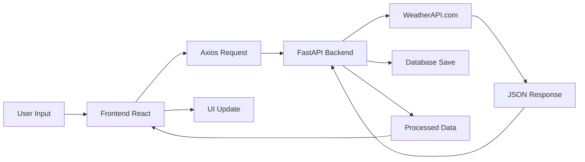

# 🌤️ Weather Dashboard - API Integration Learning Project

> **A beginner-friendly full-stack project focused on learning API integration, real-time data handling, and fast deployment workflows.**


## 📖 Project Overview

This Weather Dashboard was built as a **learning project** to understand the fundamentals of API integration and full-stack development. The primary goal wasn't to create a commercial weather app, but to gain hands-on experience with:

- **API Integration** - Learning how to send requests, handle responses, and manage errors
- **Real-time Data** - Fetching and displaying live weather information
- **Full-stack Architecture** - Connecting frontend and backend systems
- **Deployment Workflow** - Getting apps online quickly using free hosting platforms

### 🎯 Learning Objectives Achieved

✅ **API Mastery**: Understanding HTTP requests, responses, and error handling  
✅ **Data Flow**: Learning how data moves from API → Backend → Frontend → User  
✅ **Error Handling**: Managing network failures, invalid inputs, and API limitations  
✅ **Deployment**: Publishing full-stack apps using Vercel + Render  
✅ **State Management**: Basic React state handling for API data  

---

## 🛠️ Tech Stack

| Component | Technology | Purpose | Learning Focus |
|-----------|------------|---------|----------------|
| **Frontend** | React.js | User interface & API consumption | State management, API calls |
| **Backend** | FastAPI (Python) | API processing & data handling | Server logic, request routing |
| **Database** | MongoDB | Search history & analytics | Data persistence |
| **Weather API** | WeatherAPI.com | Real-time weather data | External API integration |
| **Styling** | Tailwind CSS + Radix UI | Responsive design | Modern UI patterns |
| **Charts** | Recharts | Data visualization | Chart libraries |

---

## ⭐ Key Features

### 🌍 **Core Weather Features**
- **Real-time Weather**: Current conditions for any city worldwide
- **7-Day Forecast**: Extended weather predictions with hourly breakdowns
- **Auto-location**: Detect user's location for instant weather
- **Unit Conversion**: Switch between Celsius/Fahrenheit
- **Weather Icons**: Dynamic icons based on current conditions

### 📊 **Data Visualization** 
- **Interactive Charts**: Temperature, humidity, and wind speed trends
- **24-Hour View**: Hourly weather data with responsive charts
- **Daily Comparisons**: Multi-day temperature comparisons
- **Mobile-Optimized**: Charts work perfectly on phones

### 🔍 **Search & Discovery**
- **Smart Search**: Auto-complete city search with suggestions
- **Search History**: Track your recent weather searches
- **Popular Cities**: See most-searched locations
- **Favorites**: Save frequently checked cities

### 🎨 **User Experience**
- **Dark/Light Mode**: Theme switching with preferences saved
- **Auto-refresh**: Optional automatic weather updates
- **Responsive Design**: Works on desktop, tablet, and mobile
- **Loading States**: Professional skeleton loaders during API calls

---

## 🚀 Installation & Setup

### Prerequisites
```bash
# Make sure you have these installed:
node --version  # v18+ recommended
python --version  # v3.8+ required
```

### 1️⃣ Clone the Repository
```bash
git clone <your-repo-url>
cd weather-dashboard
```

### 2️⃣ Backend Setup (Python/FastAPI)

```bash
# Navigate to backend folder
cd backend

# Install Python dependencies
pip install -r requirements.txt

# Create environment file
touch .env
```

**Add these to your `.env` file:**
```env
WEATHER_API_KEY=your_weatherapi_key_here
WEATHER_API_BASE_URL=http://api.weatherapi.com/v1
MONGO_URL=mongodb://localhost:27017
DB_NAME=weather_dashboard
```

**🔑 Get Your Weather API Key:**
1. Visit [WeatherAPI.com](https://www.weatherapi.com/)
2. Sign up for a free account
3. Copy your API key from the dashboard
4. Paste it in the `.env` file

```bash
# Start the backend server
uvicorn server:app --reload --host 0.0.0.0 --port 8001
```

### 3️⃣ Frontend Setup (React)

```bash
# Navigate to frontend folder (new terminal)
cd frontend

# Install dependencies
yarn install

# Create environment file
touch .env
```

**Add this to frontend `.env` file:**
```env
REACT_APP_BACKEND_URL=http://localhost:8001
```

```bash
# Start the frontend development server
yarn start
```

### 4️⃣ Database Setup (MongoDB)

**Option A: Local MongoDB**
```bash
# Install MongoDB locally and start the service
mongod
```

**Option B: MongoDB Atlas (Free Cloud)**
1. Create account at [MongoDB Atlas](https://www.mongodb.com/atlas)
2. Create a free cluster
3. Get connection string
4. Update `MONGO_URL` in backend `.env`

---

## 🔌 API Integration Deep Dive

### Understanding the API Flow



### Example API Requests

**1. Current Weather Request**
```javascript
// Frontend API call
const response = await weatherAPI.getCurrentWeather('London');

// What gets sent to backend:
GET /api/weather/current/London

// Backend processes and calls:
GET http://api.weatherapi.com/v1/current.json?key=XXX&q=London&aqi=no
```

**2. Forecast Request**
```javascript
// Frontend API call
const forecast = await weatherAPI.getWeatherForecast('Tokyo', 7);

// Backend API call:
GET http://api.weatherapi.com/v1/forecast.json?key=XXX&q=Tokyo&days=7
```

### Error Handling Examples

```javascript
// Frontend error handling
try {
  const data = await weatherAPI.getCurrentWeather(cityName);
  setWeatherData(data);
} catch (error) {
  if (error.isCityNotFound()) {
    setError('City not found. Please check spelling.');
  } else if (error.isNetworkError()) {
    setError('Network connection failed. Check internet.');
  } else if (error.isAPIError()) {
    setError('Weather service temporarily unavailable.');
  }
}
```

**Backend Error Processing:**
```python
# Python backend error handling
try:
    async with session.get(url, params=params) as response:
        if response.status == 200:
            data = await response.json()
            return WeatherResponse(**data)
        elif response.status == 400:
            error_data = await response.json()
            if 'No matching location found' in error_data.get('error', {}).get('message', ''):
                raise ValueError(f"City '{city}' not found")
except aiohttp.ClientError:
    raise ValueError("Network connection failed")
```

---

## 🌐 Deployment Guide

### 🚀 Frontend Deployment (Vercel)

**Why Vercel?** Free, fast, automatic deployments from Git.

```bash
# Install Vercel CLI
npm i -g vercel

# Navigate to frontend folder
cd frontend

# Deploy
vercel

# Follow prompts:
# 1. Link to existing project? N
# 2. Project name: weather-dashboard-frontend  
# 3. Directory: ./
# 4. Deploy? Y
```

**Production Environment Variables:**
```env
REACT_APP_BACKEND_URL=https://your-backend-url.onrender.com
```

### 🐍 Backend Deployment (Render)

**Why Render?** Free Python hosting with easy MongoDB connection.

**Step 1: Prepare for Deployment**
```bash
# Create Procfile in backend folder
echo "web: uvicorn server:app --host 0.0.0.0 --port $PORT" > Procfile

# Make sure requirements.txt is updated
pip freeze > requirements.txt
```

**Step 2: Deploy to Render**
1. Push code to GitHub
2. Connect GitHub to Render
3. Create new Web Service
4. Select your repository
5. Configure:
   - **Environment**: Python 3
   - **Build Command**: `pip install -r requirements.txt`
   - **Start Command**: `uvicorn server:app --host 0.0.0.0 --port $PORT`

**Step 3: Environment Variables on Render**
```env
WEATHER_API_KEY=your_weatherapi_key
WEATHER_API_BASE_URL=http://api.weatherapi.com/v1
MONGO_URL=your_mongodb_atlas_connection_string
DB_NAME=weather_dashboard
```

### 🔗 Connect Frontend to Backend
Once backend is deployed, update frontend `.env`:
```env
REACT_APP_BACKEND_URL=https://your-app-name.onrender.com
```

---

## 🧪 Testing the APIs

### Manual Testing with curl

**Test Backend Health:**
```bash
curl https://your-backend-url.onrender.com/api/health
```

**Get Current Weather:**
```bash
curl "https://your-backend-url.onrender.com/api/weather/current/London"
```

**Search Cities:**
```bash
curl "https://your-backend-url.onrender.com/api/cities/search?q=New"
```

### Response Examples

**Successful Weather Response:**
```json
{
  "location": {
    "name": "London",
    "region": "City of London, Greater London",
    "country": "United Kingdom",
    "lat": 51.52,
    "lon": -0.11,
    "tz_id": "Europe/London",
    "localtime": "2024-01-15 14:30"
  },
  "current": {
    "temp_c": 7.0,
    "temp_f": 44.6,
    "condition": {
      "text": "Partly cloudy",
      "icon": "//cdn.weatherapi.com/weather/64x64/day/116.png",
      "code": 1003
    },
    "wind_kph": 13.0,
    "humidity": 82,
    "pressure_mb": 1015.0,
    "vis_km": 10.0,
    "uv": 2.0
  }
}
```

**Error Response:**
```json
{
  "error": "city_not_found",
  "message": "City 'InvalidCity' not found"
}
```

---

## 💡 Key Learning Points

### 🔌 **1. API Integration Mastery**

**What I Learned:**
- How to make HTTP requests from both frontend (Axios) and backend (aiohttp)
- Handling different response codes (200, 400, 404, 500)
- Managing API keys securely with environment variables
- Implementing retry logic and graceful error handling

**Real Example:**
```javascript
// Before: Hardcoded data
const weatherData = { temp: 25, condition: "Sunny" };

// After: Real API integration
const weatherData = await fetch('/api/weather/current/London')
  .then(response => response.json());
```

### 🚀 **2. Deployment Workflow**

**What I Learned:**
- **Frontend Deployment**: Static site hosting with Vercel
- **Backend Deployment**: Server deployment with Render
- **Environment Management**: Different configs for development vs production
- **Cross-Origin Setup**: Configuring CORS for frontend-backend communication

**Key Insight:** Deployment isn't just "putting code online" - it's about environment configuration, database connections, and making services talk to each other across the internet.

### ⚛️ **3. React State Management for APIs**

**What I Learned:**
- Managing loading states during API calls
- Handling different error types with appropriate UI feedback
- Caching data to reduce unnecessary API requests
- Real-time updates and auto-refresh functionality

```javascript
// Loading, data, and error states
const [weatherData, setWeatherData] = useState(null);
const [isLoading, setIsLoading] = useState(false);
const [error, setError] = useState(null);

// API call with proper state management
const fetchWeather = async (city) => {
  setIsLoading(true);
  setError(null);
  
  try {
    const data = await weatherAPI.getCurrentWeather(city);
    setWeatherData(data);
  } catch (err) {
    setError(err.message);
  } finally {
    setIsLoading(false);
  }
};
```

### 🗂️ **4. Full-Stack Architecture**

**What I Learned:**
- How frontend and backend communicate through APIs
- Data flow: User Input → Frontend → Backend → External API → Database → Response
- Environment configuration across different services
- Managing different concerns (UI logic vs business logic vs data logic)

---

## 📂 Project Structure

```
weather-dashboard/
│
├── 📱 frontend/                 # React.js Frontend
│   ├── src/
│   │   ├── components/         # UI Components
│   │   │   ├── Dashboard.jsx   # Main dashboard
│   │   │   ├── WeatherCard.jsx # Weather display
│   │   │   ├── SearchBar.jsx   # City search
│   │   │   └── ForecastChart.jsx # Charts & graphs
│   │   ├── services/
│   │   │   └── weatherApi.js   # 🔑 API integration layer
│   │   ├── utils/
│   │   │   └── timezone.js     # Date/time utilities
│   │   └── hooks/              # Custom React hooks
│   ├── package.json
│   └── .env                    # Frontend environment config
│
├── 🐍 backend/                  # FastAPI Backend
│   ├── server.py              # 🔑 Main API server
│   ├── weather_service.py     # 🔑 WeatherAPI.com integration
│   ├── models.py              # Data models
│   ├── requirements.txt       # Python dependencies
│   └── .env                   # Backend environment config
│
└── 📊 features/
    ├── Real-time weather data
    ├── 7-day forecasts
    ├── Interactive charts
    ├── Search history
    ├── Mobile responsive design
    └── Dark/light mode
```

---

## 🔧 Development Workflow

### Local Development Process

1. **Start Backend** (Terminal 1):
```bash
cd backend
uvicorn server:app --reload --port 8001
```

2. **Start Frontend** (Terminal 2):
```bash
cd frontend  
yarn start
```

3. **Open Browser**: http://localhost:3000

### Development Tips I Learned

**🔍 Debugging API Issues:**
```bash
# Check if backend is running
curl http://localhost:8001/api/health

# Test specific endpoints
curl "http://localhost:8001/api/weather/current/London"

# Check frontend network tab for API calls
```

**⚡ Fast Development Cycle:**
1. Make API changes in `weather_service.py`
2. Test with curl
3. Update frontend component
4. See changes in browser instantly (hot reload)

---

## 🌐 Deployment Experience

### Frontend Deployment (Vercel) ⚡

**Why Vercel?**
- Free hosting for frontend
- Automatic deployments from Git
- Global CDN for fast loading
- Easy custom domain setup

**Deployment Steps:**
```bash
# 1. Install Vercel CLI
npm i -g vercel

# 2. Deploy from frontend folder
cd frontend
vercel

# 3. Set environment variable in Vercel dashboard:
# REACT_APP_BACKEND_URL = https://your-backend.onrender.com
```

**Learning:** Frontend deployment is just serving static files, but environment variables need to be configured for API connections.

### Backend Deployment (Render) 🐍

**Why Render?**
- Free Python hosting
- Easy database connections
- Automatic deployments from Git
- Built-in environment management

**Deployment Process:**
1. **Prepare Code:**
   ```bash
   # Add Procfile
   echo "web: uvicorn server:app --host 0.0.0.0 --port \$PORT" > Procfile
   ```

2. **Deploy on Render:**
   - Connect GitHub repository
   - Choose "Web Service"
   - Set build command: `pip install -r requirements.txt`
   - Set start command: `uvicorn server:app --host 0.0.0.0 --port $PORT`

3. **Configure Environment Variables:**
   ```env
   WEATHER_API_KEY=your_api_key_here
   MONGO_URL=your_mongodb_atlas_url
   DB_NAME=weather_dashboard
   ```

**Learning:** Backend deployment involves server configuration, environment variables, and ensuring the server binds to the correct host/port that the platform provides.

---

## 🎓 Educational Takeaways

### 🔄 **API Integration Journey**

**Before this project:** "APIs are just URLs that return data"

**After this project:** Understanding of:
- HTTP status codes and their meanings
- Request/response cycles and timing
- Error handling strategies
- Rate limiting and API quotas
- Environment variable management
- Async programming for API calls

### 🌍 **Deployment Learning Curve**

**Key Insights:**
1. **Environment Separation**: Development vs Production configurations
2. **Service Communication**: Making frontend and backend talk across internet
3. **CORS Configuration**: Allowing cross-origin requests
4. **Database Hosting**: Using cloud MongoDB vs local database

**Real-world Deployment Checklist:**
- ✅ Environment variables configured
- ✅ CORS enabled for production domains
- ✅ Database connection string updated
- ✅ API endpoints tested in production
- ✅ Frontend pointing to production backend

### 📱 **Full-Stack Data Flow**

Understanding how data moves through the application:

```
User Types "London" 
    ↓
React SearchBar Component
    ↓
Axios HTTP Request → /api/weather/current/London
    ↓
FastAPI Backend Route Handler
    ↓
WeatherService Class → WeatherAPI.com
    ↓
Real Weather Data Response
    ↓
Save to MongoDB (Search History)
    ↓
Return JSON to Frontend
    ↓
React State Update → UI Re-render
    ↓
User Sees Weather Information
```

---

## 🔧 Technical Implementation Highlights

### WeatherAPI.com Integration
```python
# backend/weather_service.py
class WeatherService:
    async def get_current_weather(self, city: str):
        url = f"{self.base_url}/current.json"
        params = {'key': self.api_key, 'q': city, 'aqi': 'no'}
        
        async with aiohttp.ClientSession() as session:
            async with session.get(url, params=params) as response:
                if response.status == 200:
                    data = await response.json()
                    return WeatherResponse(**data)
                elif response.status == 400:
                    raise ValueError(f"City '{city}' not found")
                # ... more error handling
```

### Frontend API Service
```javascript
// frontend/src/services/weatherApi.js
class WeatherAPI {
  async getCurrentWeather(city) {
    const response = await this.client.get(`/weather/current/${city}`);
    return response.data;
  }
  
  // Error handling with custom error class
  handleError(error, location) {
    if (error.response?.status === 404) {
      throw new WeatherAPIError('city_not_found', 'City not found');
    }
    // ... more error handling
  }
}
```

---

## 📈 Performance & Analytics

The app includes performance monitoring to understand API response times:

```javascript
// Performance tracking
const [performanceMetrics, setPerformanceMetrics] = useState({
  loadTime: 0,
  apiResponseTime: 0,
  renderTime: 0
});

// Measure API call performance
const startTime = performance.now();
const data = await weatherAPI.getCurrentWeather(city);
const endTime = performance.now();
setPerformanceMetrics(prev => ({
  ...prev,
  apiResponseTime: endTime - startTime
}));
```

---

## 🛟 Common Issues & Solutions

### Issue 1: CORS Errors
**Problem:** Frontend can't connect to backend  
**Solution:** Configure CORS in FastAPI
```python
app.add_middleware(
    CORSMiddleware,
    allow_origins=["*"],  # In production, specify exact domains
    allow_credentials=True,
    allow_methods=["*"],
    allow_headers=["*"],
)
```

### Issue 2: API Key Not Working
**Problem:** 401/403 errors from WeatherAPI  
**Solution:** 
1. Verify API key is correct
2. Check environment variables are loaded
3. Ensure API key is active on WeatherAPI.com

### Issue 3: MongoDB Connection Fails
**Problem:** Database connection errors  
**Solution:**
1. Check MONGO_URL format
2. Verify database is running
3. For Atlas: whitelist IP addresses

---

## 🎯 What's Next?

### Potential Enhancements for Further Learning

- **Authentication**: Add user accounts with JWT tokens
- **Caching**: Implement Redis for faster API responses  
- **Testing**: Add unit tests with Jest and pytest
- **PWA**: Make it installable as a mobile app
- **Real-time**: WebSocket updates for live weather changes
- **Maps**: Integrate Google Maps for visual weather
- **Notifications**: Weather alerts and push notifications

---

## 📚 Learning Resources

### APIs & Integration
- [WeatherAPI.com Documentation](https://www.weatherapi.com/docs/)
- [FastAPI Tutorial](https://fastapi.tiangolo.com/tutorial/)
- [Axios Documentation](https://axios-http.com/docs/intro)

### Deployment
- [Vercel Documentation](https://vercel.com/docs)
- [Render Deployment Guide](https://render.com/docs)
- [MongoDB Atlas Setup](https://docs.atlas.mongodb.com/getting-started/)

### Frontend Development
- [React Documentation](https://react.dev/)
- [Tailwind CSS](https://tailwindcss.com/docs)
- [Recharts Examples](https://recharts.org/en-US/examples)

---

## 🏆 Project Achievements

### Technical Skills Gained
- ✅ **API Integration**: HTTP requests, error handling, async programming
- ✅ **Database Operations**: MongoDB CRUD, data persistence
- ✅ **Frontend-Backend Communication**: REST APIs, CORS, environment config
- ✅ **Deployment Pipeline**: Git → Cloud hosting → Production apps
- ✅ **Error Handling**: User-friendly error messages, retry logic
- ✅ **Performance**: API response monitoring, loading states

### Development Best Practices Learned
- Environment variable management
- Separation of concerns (UI vs business logic)
- Error-first development approach
- Mobile-responsive design principles
- User experience optimization

---

## 🤝 Contributing & Learning

This project is open for educational purposes! If you're learning:

1. **Fork the repository**
2. **Try adding features**:
   - Weather alerts
   - Historical weather data
   - Weather maps integration
   - Social sharing features

3. **Experiment with deployment**:
   - Try different hosting platforms
   - Set up custom domains
   - Implement CI/CD pipelines

---

## ⚡ Quick Start

```bash
# Backend (Terminal 1)
cd backend && pip install -r requirements.txt
echo "WEATHER_API_KEY=your_key" > .env
uvicorn server:app --reload --port 8001

# Frontend (Terminal 2)  
cd frontend && yarn install
echo "REACT_APP_BACKEND_URL=http://localhost:8001" > .env
yarn start

# Open http://localhost:3000
```

---

## 📝 License

This project is for educational purposes. Feel free to use, modify, and learn from it!

---

**🌟 Remember: This project is about the learning journey, not just the destination. Every API call, every error handled, and every deployment teaches valuable real-world development skills!**

---

*Built with ❤️ for learning • Powered by WeatherAPI.com*
